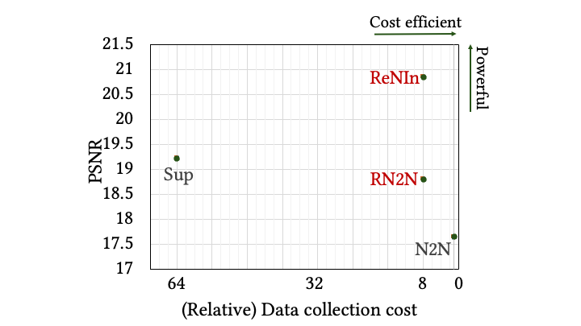
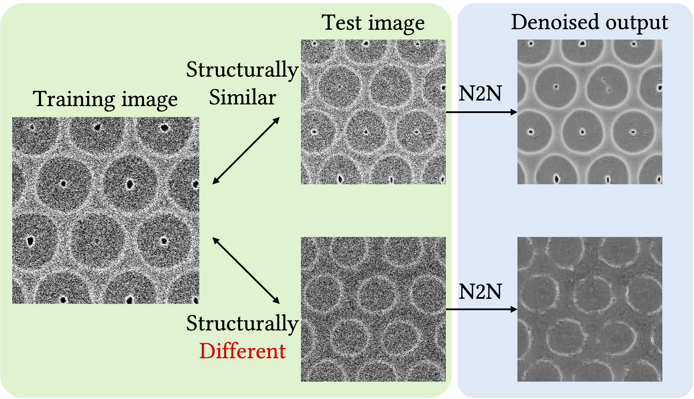
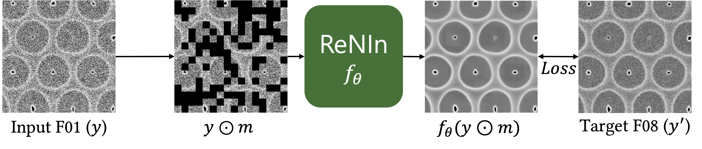

 
<i>
  <b>Figure 1. Qualitative comparison of denoising results. </b> The first row shows denoising performance on normal structured (F01) input images, while the second row presents results on structurally different (SDF01) images. The middle section illustrates the denoising results, and the right section displays the final circle detection outcomes, with "Good" detection marked in green and "Bad" detection marked in red. ReNIn demonstrates superior denoising and edge-preserving capabilities across both image types, whereas other methods fail to maintain structural integrity in SDF01 images, resulting in poor detection performance.
</i>

  

    <h2>Abstract</h2>
    

      Noise in scanning electron microscopy (SEM) often obscures details that are critical for accurate wafer defect inspection. Deep learning-based denoising methods have been widely used to address this problem, but they have two major limitations in SEM image denoising: lack of both efficient and powerful denoising methods, and poor generalization to image structures that are unseen during training.   

      We propose <u>Re</u>laxed <u>N</u>oise2Noise with <u>In</u>put dropout (<b>ReNIn</b>), which includes components that address the above two issues. Firstly, our Relaxed Noise2Noise (RN2N) framework provides a much better trade-off between the denoising performance and training data collection costs. Secondly, our input dropout method improves generalization, enhancing performance on images structurally different from the training data while maintaining strong results on normal images.
    

  

---

## Background
<table>
  <tr>
    <th style="width:50%; font-weight:normal;">
      
      <i>
        <b>Figure2. Training data collection cost vs. Denoising performance (PSNR).</b> We compare models on our SEM wafer dataset, using PSNR as the evaluation metric. Each point on the x-axis represents the number of raw noisy images (F#) needed to obtain a target image.
      </i>
    </th>
    <th style="width:50%; font-weight:normal;" >
      
      <i >
        <b>Figure3. Generalization issue of Noise2Noise (N2N).</b> The upper-right image shows a test image similar to the training set (regular circles), while the lower-right represents a structurally different test image (irregular circles). N2N struggles with the latter, particularly in preserving edges.
      </i>
    </th>
  </tr>
</table>

Noise from SEM images complicates wafer defect inspection, a crucial task in semiconductor manufacturing. Traditional approaches involve averaging multiple noisy frames to obtain a clean image, a method that is resource-intensive and expensive. Deep learning-based techniques, like Noise2Noise (N2N) ([Lehtinen et al., 2018])(#Lehtinen), have gained traction but face challenges regarding generalization and efficiency.

### Key Challenges:
1. **Efficiency**: There is a trade-off between collecting training data (the number of raw noisy images) and denoising performance (measured in PSNR). See Figure2.
2. **Generalization**: Models trained on regular structures often fail when applied to images with irregular patterns. See Figure3.

### Solution: ReNIn

<i>
    Figure3. <b>Overall training procedure of ReNIn.</b> Here, $\odot$ denotes element-wise multiplication. Note that the masking strategy is only applied in the training phase, not during the inference phase.
</i>

    <b>ReNIn</b> incorporates two main innovations: 
    <ol>
        <li style='font-size:18px'> <b>RN2N</b> (Relaxed Noise2Noise): A middle ground between supervised denoisers and N2N to reduce the cost of collecting training data without sacrificing performance.
        </li>
        <li style='font-size:18px'> <b>Input Dropout</b>: This technique improves generalization to unseen structures by randomly dropping pixels during training, forcing the model to learn better representations.
        </li>
    </ol>
<!-- - <b>RN2N</b> (Relaxed Noise2Noise): A middle ground between supervised denoisers and N2N to reduce the cost of collecting training data without sacrificing performance.
- <b>Input Dropout</b>: This technique improves generalization to unseen structures by randomly dropping pixels during training, forcing the model to learn better representations. -->

---

## Experimental Results
In our experiments, the ReNIn method demonstrates **superior denoising performance** compared to supervised learning, especially on challenging structurally different (SDF01) images. As shown in both quantitative (PSNR, SSIM) and qualitative results, ReNIn produces **clearer images while preserving edge details**, outperforming other methods that either struggle with noise removal or lose structural integrity. It achieves results **nearly indistinguishable from those of supervised learning but at a significantly lower data collection cost** ($8 \times$ cheaper), demonstrating its strong generalization ability, further enhanced by the use of input dropout.

### PSNR(dB)/SSIM results 
Since the evaluation images consist of one F01 and two SDF01 images, they are referred to as 1st F01, 1st SDF01, and 2nd SDF01 for convenience. The "average" column in PSNR/SSIM shows the averaged PSNR/SSIM values of the three evaluation images.  
The best results for each image are marked in **bold**, while the second ones are _underlined_, except for the median filter (F32), which utilized high-cost F32 images as input.

| Category                  | Model                            | 1st F01              | 1st SDF01           | 2nd SDF01            | Average             |
|---------------------------|-----------------------------------|----------------------|---------------------|----------------------|---------------------|
| **Conventional**           | Median filter (F32)              | 22.64 / 0.3382       | 21.70 / 0.2616      | 21.19 / 0.2409       | 21.84 / 0.2802       |
|                           | Median filter (F01)              | 20.44 / 0.3143       | 14.09 / 0.2206      | 17.56 / 0.2130       | 17.36 / 0.2493       |
|                           | BM3D [[Dabov et al., 2007]](#Dabov)        | 21.34 / 0.2974       | 15.12 / 0.2008      | 17.70 / 0.1905       | 18.05 / 0.2296       |
| **Deep learning-based**    | Noise2Void [[Krull et al., 2019]](#Krull)  | 14.56 / 0.0792       | 12.20 / 0.0500      | 13.35 / 0.0540       | 13.37 / 0.0611       |
|                           | FBI-denoiser [[Byun et al., 2021]](#Byun) | 14.71 / 0.0827       | 12.30 / 0.0505      | 13.42 / 0.0537       | 13.48 / 0.0623       |
|                           | Noise2Noise [[Lehtinen et al., 2018]](#Lehtinen) | 21.92 / 0.2990       | 14.40 / 0.1150      | 16.63 / 0.1403       | 17.65 / 0.1848       |
|                           | Supervised learning              | **23.66 / 0.3668**   | _16.24 / 0.1727_    | _17.77 / 0.1830_     | _19.22 / 0.2408_     |
|                           | **ReNIn (Ours)**                     | _23.05 / 0.3446_     | **20.39 / 0.2508**  | **19.12 / 0.2181**   | **20.85 / 0.2712**   |

### Failure rate (FR) results  
Details are the same as Table [PSNR(dB)/SSIM results](#quantitative-results).

| Category                  | Model                            | 1st F01              | 1st SDF01           | 2nd SDF01            | Average             |
|---------------------------|-----------------------------------|----------------------|---------------------|----------------------|---------------------|
| **Conventional**           | Median filter (F32)              | 0.00%                | 0.00%               | 0.00%                | 0.00%               |
|                           | Median filter (F01)              | 12.50%               | 36.57%              | _52.31%_             | _33.80%_            |
|                           | BM3D [[Dabov et al., 2007]](#Dabov)       | 8.33%                | _34.26%_            | 67.59%               | 36.73%              |
|===========================|===================================|======================|=====================|======================|=====================|
| **Deep learning-based**    | Noise2Void [[Krull et al., 2019]](#Krull)  | _0.93%_              | 96.30%              | 87.04%               | 61.42%              |
|                           | FBI-denoiser [[Byun et al., 2021]](#Byun) | 1.85%                | 96.30%              | 83.33%               | 60.49%              |
|                           | Noise2Noise [[Lehtinen et al., 2018]](#Lehtinen) | 0.00%              | 100.00%             | 100.00%              | 66.67%              |
|                           | Supervised learning              | 0.00%                | 100.00%             | 100.00%              | 66.67%              |
|                           | **ReNIn (Ours)**                 | **0.00%**            | **0.93%**           | **2.31%**            | **1.08%**           |

### Qualitative results
See [Figure 1](#visual_result) for a qualitative comparison of denoising results with supervised learning.

---
## Reference
- Dabov, K., Foi, A., Katkovnik, V., and Egiazarian, K. (2007). Image denoising by sparse 3-D transform-domain collaborative filtering. IEEE Transactions on Image Processing, pages 2080–2095. 
- Krull, A., Buchholz, T.-O., and Jug, F. (2019). Noise2void-learning denoising from single noisy images. In Proceedings of the IEEE/CVF Conference on Computer Vision and Pattern Recognition, pages 2129–2137. Institute of Electrical and Electronics Engineers/The Computer Vision Foundation. 
- Byun, J., Cha, S., and Moon, T. (2021). FBI-denoiser: Fast blind image denoiser for poisson-gaussian noise. In Proceedings of the IEEE/CVF Conference on Computer Vision and Pattern Recognition, pages 5768–5777. Institute of Electrical and Electronics Engineers/The Computer Vision Foundation. 
- Lehtinen, J., Munkberg, J., Hasselgren, J., Laine, S., Karras, T., Aittala, M., and Aila, T. (2018). Noise2Noise: Learning image restoration without clean data. In International Conference on Machine Learning, pages 4620–4631. International Machine Learning Society. 

> **Note**: This project page is under construction. Content is for demonstration purposes only.
